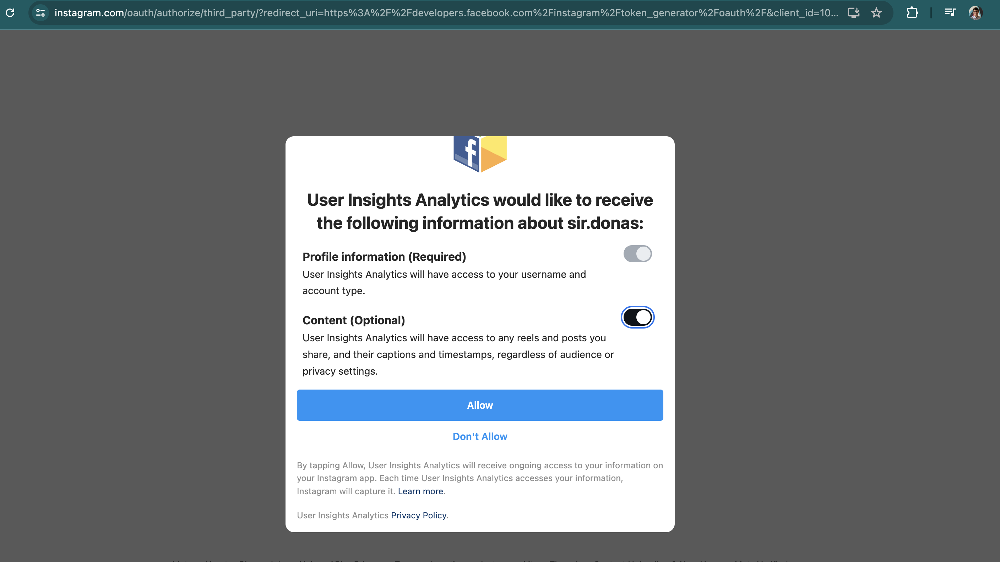

# instagram_data
Create a Meta App which extracts user's data using API
# Create a Meta App

1. Go to [facebook apps](https://developers.facebook.com/apps) and sign-in with your facebook user:
2. Create an app with the following config
   
   
   
   
   

# Get User Token

1. Go to Basic Display and add a testing User
   
   
3. Log in Instagram with the testing user account, go to Setting, then to Apps & Websites and accept the invite to the app
   
   
4. Generate token and accept from the testing user instagram account


# Your first API call

Get the user profile with this URl (add your own access_token):
```
https://graph.instagram.com/me/media?fields=media_url&access_token=
```
Voilà!

[Documentation](https://developers.facebook.com/docs/instagram-basic-display-api/guides/getting-profiles-and-media)
